# Anatomy of a Booker Chunk

This diagram illustrates the sophisticated structure of chunks in the Booker RAG system, showing how they go far beyond basic RAG implementations.

## Chunk Structure Diagram

```mermaid
graph TB
    subgraph "🔖 Booker Chunk Structure"
        subgraph "🆔 Core Identity"
            A1["chunk_id: 142<br/>embedding_index: 141<br/>file_name: 'stereo_guide.pdf'"]
        end
        
        subgraph "📍 Location & Structure"
            B1["page_range: '45-55'<br/>heading: 'Portrait Techniques'<br/>heading_level: 2<br/>heading_type: 'section'"]
        end
        
        subgraph "📝 Raw Content"
            C1["text: 'This section discusses<br/>advanced stereoscopic photography<br/>techniques for portrait work...'<br/>(Original chunk text)"]
        end
        
        subgraph "🧠 AI-Generated Intelligence"
            D1["summary: 'Advanced stereo portrait<br/>techniques with camera spacing<br/>and lighting considerations.'<br/>(LLM-generated, ≤2 sentences)"]
        end
        
        subgraph "🏷️ NLP Extraction"
            E1["keywords: ['stereoscopic',<br/>'photography', 'portrait',<br/>'camera', 'lighting']"]
            E2["entities: [<br/>  {'text': 'Realist Camera', 'label': 'PRODUCT'},<br/>  {'text': 'NSA', 'label': 'ORG'}<br/>]"]
        end
        
        subgraph "📊 Hierarchical Context"
            F1["source_type: 'body_of_work'<br/>importance_level: 0<br/>importance_name: 'PRIMARY'<br/>source_directory: '0/'"]
        end
        
        subgraph "🔗 Vector Connection"
            G1["embedding: [0.123, -0.456, 0.789...]<br/>(3072-dimensional vector<br/>stored in FAISS index)"]
        end
    end
    
    subgraph "⚡ Comparison: Basic RAG vs Booker RAG"
        subgraph "🟡 Basic RAG Chunk"
            H1["text: 'Raw content...'<br/>embedding: [vector]<br/>maybe: source_file"]
        end
        
        subgraph "🟢 Booker Enhanced Chunk"
            I1["✅ All Basic RAG features<br/>+ Document structure (headings)<br/>+ AI summaries<br/>+ Named entity extraction<br/>+ Keyword extraction<br/>+ Hierarchical importance<br/>+ Multi-level organization<br/>+ Page/location tracking"]
        end
    end
    
    %% Connections showing data flow
    A1 --> G1
    C1 --> D1
    C1 --> E1
    C1 --> E2
    B1 --> F1
    
    %% Styling
    classDef identity fill:#e3f2fd,stroke:#1976d2
    classDef location fill:#f3e5f5,stroke:#7b1fa2
    classDef content fill:#fff3e0,stroke:#f57f17
    classDef ai fill:#e8f5e8,stroke:#388e3c
    classDef nlp fill:#fce4ec,stroke:#c2185b
    classDef hierarchy fill:#f1f8e9,stroke:#689f38
    classDef vector fill:#fff8e1,stroke:#ffa000
    classDef basic fill:#fff3c4,stroke:#ff8f00
    classDef enhanced fill:#c8e6c9,stroke:#4caf50
    
    class A1 identity
    class B1 location
    class C1 content
    class D1 ai
    class E1,E2 nlp
    class F1 hierarchy
    class G1 vector
    class H1 basic
    class I1 enhanced
```

## What Makes Booker Chunks Special?

### 1. **Multi-Dimensional Metadata**
Unlike basic RAG systems that typically store just text + embedding, Booker chunks contain 7 different categories of information:

- **Identity**: Unique IDs and source tracking
- **Structure**: Document hierarchy and page locations
- **Content**: The actual text content
- **AI Intelligence**: LLM-generated summaries
- **NLP Features**: Keywords and named entities
- **Hierarchy**: Importance levels and organizational context
- **Vectors**: High-dimensional embeddings for semantic search

### 2. **Hierarchical Importance System**
- **PRIMARY** (0/): Main content material
- **SECONDARY** (1/): Supporting documentation  
- **TERTIARY** (2/): Additional references
- **QUATERNARY** (3/): Supplementary material

This allows the system to prioritize information and provide context about source reliability.

### 3. **Document Structure Preservation**
- Maintains heading hierarchy (H1, H2, H3, etc.)
- Preserves section relationships
- Enables structured navigation and citation

### 4. **AI-Enhanced Metadata**
- **Summaries**: Concise, context-aware descriptions
- **Keywords**: Automatically extracted key terms
- **Entities**: Named entity recognition (people, organizations, products)

### 5. **Benefits for RAG Applications**

| Basic RAG | Booker Enhanced RAG |
|-----------|-------------------|
| Text similarity only | Multi-modal retrieval (semantic + structural + metadata) |
| Generic responses | Context-aware responses with proper attribution |
| No source hierarchy | Importance-weighted results |
| Limited citation | Rich citations with page numbers, headings, summaries |
| Flat organization | Hierarchical document understanding |

This sophisticated chunk structure enables much more intelligent and contextual responses than traditional RAG systems, making it ideal for complex document collections like technical manuals, academic papers, or multi-volume works. 