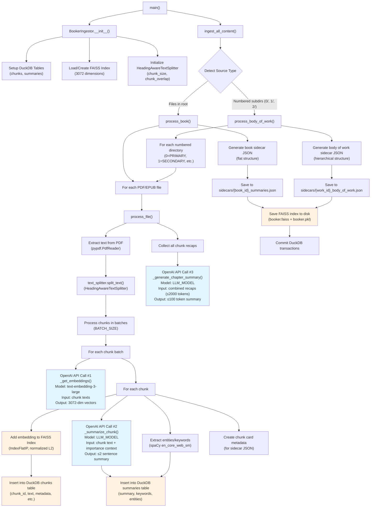

# Booker Ingestion Flow

This diagram shows the complete data flow for processing documents in the Booker system, from source files to searchable databases.

## Flow Diagram

## Key Components

### OpenAI API Calls (Light Blue)
1. **Embeddings**: `text-embedding-3-large` model converts text chunks into 3072-dimensional vectors
2. **Chunk Summaries**: LLM generates ≤2 sentence summaries for individual chunks with importance context
3. **Chapter/Work Summaries**: LLM creates ≤100 token summaries from combined chunk recaps

### Database Operations (Light Orange)
1. **FAISS Index**: Stores normalized L2 embeddings for semantic search
2. **DuckDB Tables**: 
   - `chunks` table: text, metadata, headings, source info
   - `summaries` table: LLM summaries, keywords, entities
3. **Sidecar JSONs**: Rich metadata files for UI presentation

### Text Processing
- **HeadingAwareTextSplitter**: Intelligently chunks text while preserving document structure
- **spaCy**: Extracts named entities and keywords
- **Importance Levels**: Hierarchical content prioritization (PRIMARY → QUATERNARY)

### Content Types
- **Books**: Files directly in source directory → flat structure
- **Bodies of Work**: Numbered subdirectories (0/, 1/, 2/) → hierarchical importance structure

## Output Artifacts

The ingestion process creates:
1. **FAISS Index** (`booker.faiss` + `booker.pkl`) - for semantic search
2. **DuckDB Database** (`booker.db`) - structured data storage
3. **Sidecar JSON files** - rich metadata for UI presentation

This creates a multi-modal search system combining semantic embeddings, structured metadata, and human-readable summaries for comprehensive document retrieval and understanding. 