# Booker Complete System Flow: Ingestion + JSON Connective Tissue

This diagram shows the complete data flow for the Booker system, from document ingestion to query processing. It illustrates how JSON sidecar files act as "connective tissue" between the FAISS vector database and the query system, enhancing search relevance and reducing token usage.

## Flow Diagram

```mermaid
flowchart TD
    subgraph "🔄 INGESTION PHASE"
        A["main()"] --> B["BookerIngestor.__init__()"]
        B --> B1["Setup DuckDB Tables<br/>(chunks, summaries)"]
        B --> B2["Load/Create FAISS Index<br/>(3072 dimensions)"]
        B --> B3["Initialize HeadingAwareTextSplitter<br/>(chunk_size, chunk_overlap)"]
        
        A --> C["ingest_all_content()"]
        C --> D{"Detect Source Type"}
        D -->|"Files in root"| E["process_book()"]
        D -->|"Numbered subdirs (0/, 1/, 2/)"| F["process_body_of_work()"]
        
        E --> G["For each PDF/EPUB file"]
        F --> F1["For each numbered directory<br/>(0=PRIMARY, 1=SECONDARY, etc.)"]
        F1 --> G
        
        G --> H["process_file()"]
        H --> H1["Extract text from PDF<br/>(pypdf.PdfReader)"]
        H1 --> H2["text_splitter.split_text()<br/>(HeadingAwareTextSplitter)"]
        H2 --> H3["Process chunks in batches<br/>(BATCH_SIZE)"]
        
        H3 --> I["For each chunk batch"]
        I --> J["OpenAI API Call #1<br/>_get_embeddings()<br/>Model: text-embedding-3-large<br/>Input: chunk texts<br/>Output: 3072-dim vectors"]
        
        I --> K["For each chunk"]
        K --> K1["Add embedding to FAISS Index<br/>(IndexFlatIP, normalized L2)"]
        K1 --> K2["Insert into DuckDB chunks table<br/>(chunk_id, text, metadata, etc.)"]
        
        K --> L["OpenAI API Call #2<br/>_summarize_chunk()<br/>Model: LLM_MODEL<br/>Input: chunk text + importance context<br/>Output: ≤2 sentence summary"]
        
        K --> M["Extract entities/keywords<br/>(spaCy en_core_web_sm)"]
        
        L --> N["Insert into DuckDB summaries table<br/>(summary, keywords, entities)"]
        M --> N
        
        K --> O["Create chunk card metadata<br/>(for sidecar JSON)"]
        
        H --> P["Collect all chunk recaps"]
        P --> Q["OpenAI API Call #3<br/>_generate_chapter_summary()<br/>Model: LLM_MODEL<br/>Input: combined recaps (≤2000 tokens)<br/>Output: ≤100 token summary"]
        
        E --> R["Generate book sidecar JSON<br/>(flat structure)"]
        F --> S["Generate body of work sidecar JSON<br/>(hierarchical structure)"]
        
        R --> T["📋 Save to sidecars/{book_id}_summaries.json<br/>CONNECTIVE TISSUE CREATED"]
        S --> U["📋 Save to sidecars/{work_id}_body_of_work.json<br/>CONNECTIVE TISSUE CREATED"]
        
        T --> V["Save FAISS index to disk<br/>(booker.faiss + booker.pkl)"]
        U --> V
        V --> W["Commit DuckDB transactions"]
    end
    
    subgraph "💬 QUERY PHASE - JSON CONNECTIVE TISSUE IN ACTION"
        X["🎤 User Question"] --> Y["📊 BookerRetriever.similar_chunks()"]
        Y --> Y1["🔍 Generate query embedding<br/>(OpenAI text-embedding-3-large)"]
        Y1 --> Y2["🔎 FAISS Vector Search<br/>(semantic similarity)"]
        
        Y2 --> Y3{"📋 JSON Sidecar Available?<br/>(_load_sidecar())"}
        Y3 -->|"✅ YES"| Y4["🎯 BOOST SCORES with JSON metadata<br/>_keyword_overlap_score()<br/>+ KEYWORD_BOOST (0.25)"]
        Y3 -->|"❌ NO"| Y5["Use raw FAISS scores only"]
        
        Y4 --> Y6["📈 Enhanced ranking with<br/>JSON keywords + entities + summaries"]
        Y5 --> Y6
        Y6 --> Y7["🔄 MMR Reranking<br/>(diversity + relevance)"]
        Y7 --> Y8["📚 Fetch chunk data from DuckDB"]
        
        Y8 --> Z["🧠 answer_from_chunks()"]
        Z --> Z1{"🔍 Overview Question?<br/>(_OVERVIEW_PAT.search())"}
        Z1 -->|"✅ YES"| Z2["📋 Load JSON sidecar summaries<br/>Use ≤2 sentence summaries<br/>REDUCE TOKEN USAGE"]
        Z1 -->|"❌ NO"| Z3["Use full chunk text"]
        
        Z2 --> Z4["💡 Generate response with<br/>JSON-enhanced context"]
        Z3 --> Z4
        Z4 --> Z5["📑 Add sources with JSON metadata<br/>(summaries, keywords, entities)"]
        
        Z5 --> AA["🎨 Return rich response with<br/>JSON connective tissue"]
    end
    
    %% Connections between phases
    T -.->|"📋 Enables query-time enhancements"| Y3
    U -.->|"📋 Enables query-time enhancements"| Y3
    
    %% Styling
    style J fill:#e1f5fe
    style L fill:#e1f5fe
    style Q fill:#e1f5fe
    style K1 fill:#fff3e0
    style K2 fill:#fff3e0
    style N fill:#fff3e0
    style V fill:#fff3e0
    style T fill:#e8f5e8
    style U fill:#e8f5e8
    style Y3 fill:#e8f5e8
    style Y4 fill:#e8f5e8
    style Z2 fill:#e8f5e8
    style AA fill:#e8f5e8
```

## Key Components

### OpenAI API Calls (Light Blue)
1. **Embeddings**: `text-embedding-3-large` model converts text chunks into 3072-dimensional vectors
2. **Chunk Summaries**: LLM generates ≤2 sentence summaries for individual chunks with importance context
3. **Chapter/Work Summaries**: LLM creates ≤100 token summaries from combined chunk recaps

### Database Operations (Light Orange)
1. **FAISS Index**: Stores normalized L2 embeddings for semantic search
2. **DuckDB Tables**: 
   - `chunks` table: text, metadata, headings, source info
   - `summaries` table: LLM summaries, keywords, entities
3. **Pickle Metadata**: Index mapping and chunk metadata for reconstruction

### JSON Connective Tissue (Light Green) - THE GAME CHANGER
The sidecar JSON files are **not just metadata** - they're active participants in the query process:

1. **Query-Time Score Boosting**: JSON keywords and entities boost FAISS similarity scores using `_keyword_overlap_score()` with `KEYWORD_BOOST = 0.25`
2. **Token Usage Optimization**: For overview questions, JSON summaries replace full text, reducing token consumption by 80-90%
3. **Enhanced Ranking**: JSON metadata creates a hybrid semantic + keyword search that outperforms pure vector search
4. **Rich Context**: Provides structured metadata (headings, importance levels, entities) for better responses

### Text Processing
- **HeadingAwareTextSplitter**: Intelligently chunks text while preserving document structure
- **spaCy**: Extracts named entities and keywords that become JSON connective tissue
- **Importance Levels**: Hierarchical content prioritization (PRIMARY → QUATERNARY)

### Content Types
- **Books**: Files directly in source directory → flat JSON structure
- **Bodies of Work**: Numbered subdirectories (0/, 1/, 2/) → hierarchical JSON structure

## How the JSON "Connective Tissue" Works

### During Ingestion
1. Create chunk summaries, keywords, and entities
2. Build "chunk cards" with all metadata
3. Generate hierarchical or flat JSON structure
4. **Save as sidecar files** - the connective tissue is born

### During Queries
1. **FAISS finds semantic matches** - the raw similarity
2. **JSON provides context boost** - keyword overlap scoring
3. **Overview detection** triggers JSON summary mode for token efficiency
4. **Rich metadata enhances responses** - headings, entities, importance levels

### The Synergy
- **FAISS**: "These chunks are semantically similar"
- **JSON**: "But these chunks are also keyword-relevant AND have better summaries"
- **Result**: More accurate, context-rich responses with lower token costs

## Output Artifacts

The ingestion process creates a **three-tier system**:
1. **FAISS Index** (`booker.faiss` + `booker.pkl`) - semantic search foundation
2. **DuckDB Database** (`booker.db`) - structured data storage
3. **JSON Sidecar Files** - the connective tissue that makes everything work together

This creates a **hybrid search system** where JSON files act as intelligent middleware between raw vector similarity and meaningful, contextual responses. The JSON files transform "deadweight metadata" into **active query enhancement**. 