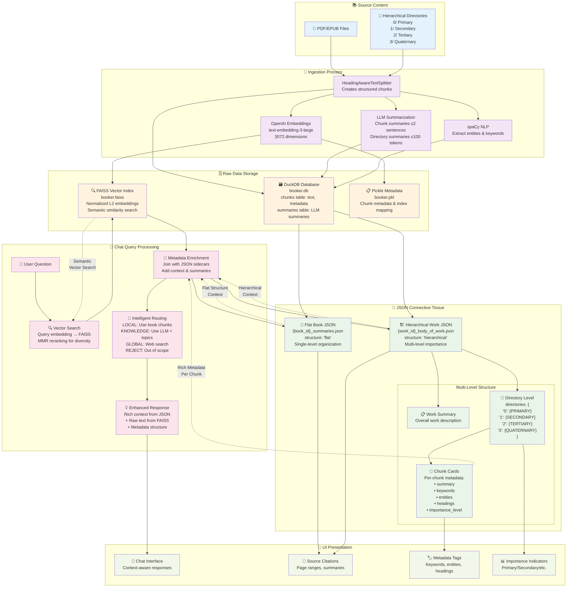

# Booker Vector Database & JSON Architecture

This diagram illustrates how the FAISS vector database and multi-level JSON "connective tissue" files work together to create a cohesive chat experience in the Booker system.

## Architecture Overview

## Key Components

### FAISS Vector Index
- **Purpose**: Semantic similarity search using 3072-dimensional embeddings
- **Technology**: OpenAI's `text-embedding-3-large` model
- **Features**: Normalized L2 embeddings with MMR reranking for result diversity

### Multi-Level JSON Structure
The JSON "connective tissue" provides contextual intelligence in two formats:

#### Flat Structure (Books)
- Simple organization for traditional books
- Files directly in source directory
- Single-level chunk organization

#### Hierarchical Structure (Bodies of Work)
- Complex multi-level organization
- Numbered directories (0/, 1/, 2/, 3/) with importance levels
- Work-level, directory-level, and chunk-level metadata

### Integration Benefits
1. **Separation of Concerns**: FAISS handles semantic search, JSON provides context
2. **Rich Metadata**: Enhanced responses with summaries, keywords, entities
3. **Hierarchical Context**: Multi-level importance and structure
4. **UI-Ready Data**: Pre-formatted for citations and user presentation 